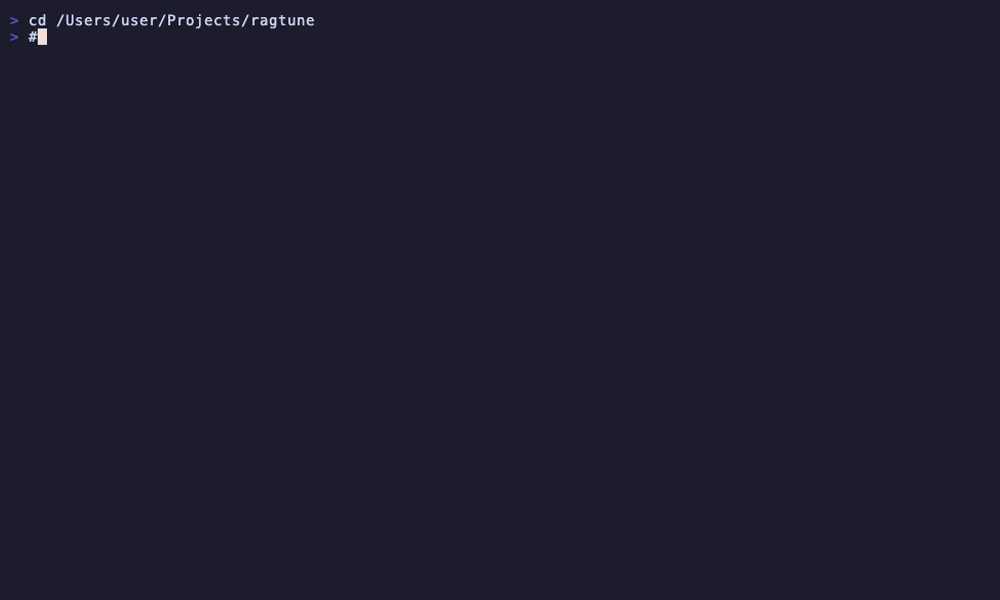

# RagTune

[](https://go.dev/)
[](LICENSE)
[](https://github.com/metawake/ragtune/releases)

**Debug, benchmark, and monitor your RAG retrieval layer** — like EXPLAIN ANALYZE for production RAG.

<p align="center">
  
</p>

<p align="center">
  <a href="#quickstart">Quickstart</a> •
  <a href="#commands">Commands</a> •
  <a href="#why-ragtune">Why RagTune</a> •
  <a href="docs/concepts.md">Concepts</a> •
  <a href="docs/faq.md">FAQ</a>
</p>

---

| I want to... | Command |
|--------------|---------|
| **Debug a single query** | `ragtune explain "my query" --collection prod` |
| **Run batch evaluation** | `ragtune simulate --collection prod --queries queries.json` |
| **Set up CI/CD quality gates** | `ragtune simulate --ci --min-recall 0.85` |
| **Compare embedders** | `ragtune compare --embedders ollama,openai --docs ./docs` |
| **Quick health check** | `ragtune audit --collection prod --queries queries.json` |

---

## Quickstart

```bash
# 1. Start vector store
docker run -d -p 6333:6333 -p 6334:6334 qdrant/qdrant

# 2. Ingest documents
ragtune ingest ./docs --collection my-docs --embedder ollama

# 3. Debug retrieval
ragtune explain "How do I reset my password?" --collection my-docs
```

No API keys needed with Ollama (runs locally).

### Build Your Test Suite

```bash
# Save queries as you debug
ragtune explain "How do I reset my password?" --collection my-docs --save
ragtune explain "What are the rate limits?" --collection my-docs --save

# Run evaluation once you have 20+ queries
ragtune simulate --collection my-docs --queries golden-queries.json
```

Each `--save` adds the query to `golden-queries.json`.

---

## What You'll See

### explain — Debug a Query

```
Query: "How do I reset my password?"

[1] Score: 0.8934 | Source: docs/auth/password-reset.md
    Text: To reset your password: 1. Click "Forgot Password"...

[2] Score: 0.8521 | Source: docs/auth/account-security.md
    Text: Account Security ## Password Management...

DIAGNOSTICS
  Score range: 0.7234 - 0.8934 (spread: 0.1700)
  ✓ Strong top match (>0.85): likely high-quality retrieval
```

### simulate — Batch Metrics

```
Running 50 queries...

  Recall@5:   0.82    MRR: 0.76    Coverage: 0.94
  Latency:    p50=45ms  p95=120ms

FAILURES: 3 queries with Recall@5 = 0
  ✗ "How do I configure SSO?"
    Expected: [sso-guide.md], Retrieved: [api-keys.md...]

💡 Run `ragtune explain "<query>"` to debug
```

---

## Commands

| Command | Purpose |
|---------|---------|
| `ingest` | Load documents into vector store |
| `explain` | Debug retrieval for a single query |
| `simulate` | Batch benchmark with metrics + CI mode |
| `compare` | Compare embedders or chunk sizes |
| `audit` | Quick health check (pass/fail) |
| `report` | Generate markdown reports |
| `import-queries` | Import queries from CSV/JSON |

See [CLI Reference](docs/cli-reference.md) for all flags and options.

---

## CI/CD Quality Gates

```yaml
# .github/workflows/rag-quality.yml
- name: RAG Quality Gate
  run: |
    ragtune ingest ./docs --collection ci-test --embedder ollama
    ragtune simulate --collection ci-test --queries tests/golden-queries.json \
      --ci --min-recall 0.85 --min-coverage 0.90 --max-latency-p95 500
```

Exit code 1 if thresholds fail. See [examples/github-actions.yml](examples/github-actions.yml) for complete setup.

---

## Why RagTune?

Most teams iterate blindly on RAG retrieval. RagTune provides diagnostics to make informed decisions.

| What Matters | Impact |
|--------------|--------|
| Domain-appropriate chunking | 7%+ recall difference |
| Embedding model choice | 5% difference |
| Continuous monitoring | Catches data drift before users do |

### RagTune vs. Other Tools

RagTune focuses on **retrieval debugging, monitoring, and benchmarking**, not end-to-end answer evaluation.

| | RagTune | Ragas / DeepEval | misbahsy/RAGTune |
|---|---------|------------------|------------------|
| **Focus** | Retrieval layer | Full pipeline | Full pipeline |
| **LLM calls** | None required | Required | Required |
| **Interface** | CLI (CI/CD-native) | Python library | Streamlit UI |
| **Speed** | Fast (embedding only) | Slow (LLM inference) | Slow |
| **CI/CD** | First-class | Manual setup | None |

**Use RagTune when:** debugging retrieval, CI/CD quality gates, comparing embedders, deterministic benchmarks.

**Use other tools when:** evaluating LLM answer quality, you need `answer_relevancy` metrics.

---

## Installation

```bash
# Homebrew (macOS/Linux)
brew install metawake/tap/ragtune

# Go Install
go install github.com/metawake/ragtune/cmd/ragtune@latest

# Or download binary from GitHub Releases
```

**Prerequisites:** Docker (for Qdrant), Ollama or API key for embeddings.

---

## Embedders

| Embedder | Setup | Best For |
|----------|-------|----------|
| `ollama` | Local, no API key | Development, privacy |
| `openai` | `OPENAI_API_KEY` | General purpose |
| `voyage` | `VOYAGE_API_KEY` | Legal, code (domain-tuned) |
| `cohere` | `COHERE_API_KEY` | Multilingual |
| `tei` | Docker container | High throughput |

## Vector Stores

| Store | Setup |
|-------|-------|
| Qdrant (default) | `docker run -p 6333:6333 qdrant/qdrant` |
| pgvector | `--store pgvector --pgvector-url postgres://...` |
| Weaviate | `--store weaviate --weaviate-host localhost:8080` |
| Chroma | `--store chroma --chroma-url http://localhost:8000` |
| Pinecone | `--store pinecone --pinecone-host HOST` |

---

## Included Benchmarks

| Dataset | Documents | Purpose |
|---------|-----------|---------|
| `data/` | 9 | Quick testing |
| `benchmarks/hotpotqa-1k/` | 398 | General knowledge |
| `benchmarks/casehold-500/` | 500 | Legal domain |
| `benchmarks/synthetic-50k/` | 50,000 | Scale testing |

```bash
# Try it
ragtune ingest ./benchmarks/hotpotqa-1k/corpus --collection demo --embedder ollama
ragtune simulate --collection demo --queries ./benchmarks/hotpotqa-1k/queries.json
```

---

## Documentation

| Guide | Description |
|-------|-------------|
| [Concepts](docs/concepts.md) | RAG basics, metrics explained |
| [CLI Reference](docs/cli-reference.md) | All commands and flags |
| [Quickstart](docs/articles/00-quickstart.md) | Step-by-step setup guide |
| [Benchmarking Guide](docs/articles/03-benchmarking-guide.md) | Scale testing, runtimes |
| [Deployment Patterns](docs/articles/04-deployment-patterns.md) | CI/CD, production |
| [FAQ](docs/faq.md) | Common questions |
| [Troubleshooting](docs/troubleshooting.md) | Common issues and fixes |

---

## Contributing

Contributions welcome. Please open an issue first to discuss significant changes.

## License

MIT
