# Key Concepts

New to RAG? This 60-second primer explains what's happening under the hood.

## How RAG Retrieval Works

```mermaid
flowchart LR
    A[📄 Documents] --> B[Chunker]
    B --> C[Embedder]
    C --> D[(Vector DB)]
    
    E[❓ Query] --> F[Embedder]
    F --> G{Similarity\nSearch}
    D --> G
    G --> H[🎯 Top-K Results]
```



## Terminology

| Term | What It Means |
|------|---------------|
| **Embedding** | Text converted to a vector (list of numbers representing meaning). Similar texts have similar vectors. |
| **Chunk** | A piece of a document. Long docs are split into chunks before embedding. |
| **Similarity score** | 0-1 scale. Higher = query and chunk have more similar meaning. |
| **Top-K** | Return the K most similar chunks to your query. |

## Why Chunk Size Matters

```
Document: "To reset your password, go to Settings, click Security, 
           then click Reset Password. You'll receive an email..."

Chunk size 100:  ["To reset your password, go to", 
                  "Settings, click Security, then",
                  "click Reset Password. You'll..."]
                  → Query matches piece 1, but context is scattered

Chunk size 500:  ["To reset your password, go to Settings, 
                   click Security, then click Reset Password. 
                   You'll receive an email..."]
                  → Full context preserved in one chunk
```

**Too small** = context gets split, retrieval misses connections  
**Too large** = noise drowns out relevant parts

## Score Interpretation

| Score Range | Meaning | Action |
|-------------|---------|--------|
| 0.90+ | Excellent match | Exactly what user asked |
| 0.75-0.90 | Good match | Relevant, may need refinement |
| 0.60-0.75 | Weak match | Might be relevant, or noise |
| < 0.60 | Poor match | Likely not what user wants |

## What Good Metrics Look Like

| Metric | Poor | Acceptable | Good | Excellent |
|--------|------|------------|------|-----------|
| **Recall@5** | < 0.60 | 0.60–0.75 | 0.75–0.90 | > 0.90 |
| **MRR** | < 0.50 | 0.50–0.70 | 0.70–0.85 | > 0.85 |
| **NDCG@5** | < 0.50 | 0.50–0.70 | 0.70–0.85 | > 0.85 |
| **Coverage** | < 0.70 | 0.70–0.85 | 0.85–0.95 | > 0.95 |
| **Latency p95** | > 500ms | 200–500ms | 50–200ms | < 50ms |

**Context matters:**
- Legal/medical domains: aim for Excellent (accuracy critical)
- Customer support: Good is often sufficient
- Creative/exploration: Acceptable may be fine

## Metrics Explained

| Metric | Description |
|--------|-------------|
| **Recall@K** | Fraction of relevant docs found in top-K results |
| **MRR** | Mean Reciprocal Rank — how high the first relevant result ranks |
| **NDCG@K** | Normalized Discounted Cumulative Gain — rewards good ranking of ALL results |
| **Coverage** | Fraction of relevant docs ever retrieved across all queries |
| **Redundancy** | Average times a doc is retrieved (detects over-representation) |
| **Diversity@K** | Fraction of unique docs in top-K (detects wasted slots from duplicates) |

## Next Steps

- [Quickstart Guide](articles/00-quickstart.md) — Get running in 5 minutes
- [Benchmarking Guide](articles/03-benchmarking-guide.md) — Scale testing and expected runtimes
